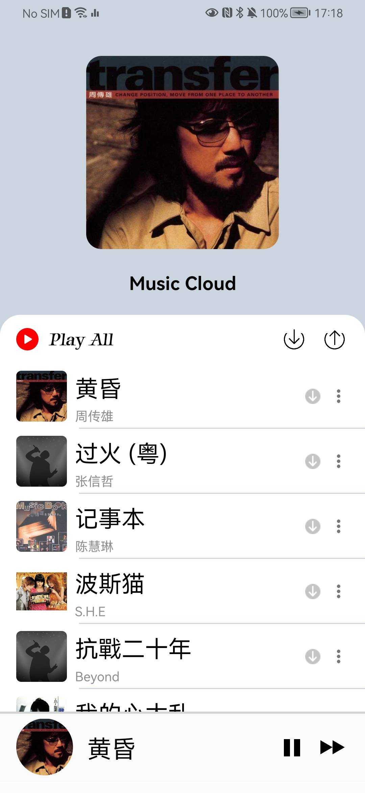
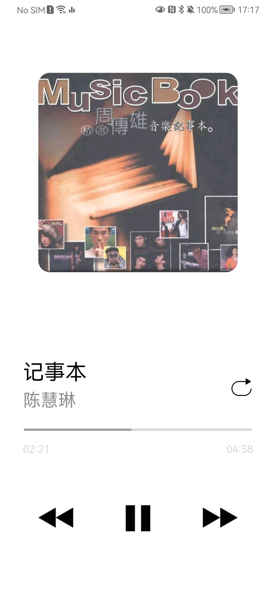

# music-cloud

A cloud music player that user can upload music to and listen from.


## File structure

```sh
├── music-cloud
│   ├── backend-go  //a go project
│   ├── frontend-android //an Android project
│   ├── frontend-web //a web project
│   ├── screenshot //place to store UI screenshots
```

***


## Requirements

1. a cloud server based on linux (In fact it's OK to do it on your computer locally if you just want to have a test. )

***


## UI screenshot

<p>


</p>


## backend-go quick start

### download executable directly

I would recommend you just download release executable targets from [this page](https://github.com/IzumiSakai-zy/music-cloud/releases/tag/v1.0), also it is not a bad choice to build it  from source code.

### build from source code

1. clone this project 

   ```shell
   cd ~
   git clone https://github.com/IzumiSakai-zy/music-cloud.git
   ```

2. checkout dependencies then build executable target

   ```shell
   cd ~/music-cloud/backend-go
   go get . #make sure dependency of this project is right
   env GOOS=linux GOARCH=amd64 go build -o music-cloud-linux-amd64
   ```

3. transfer executable target to your remote server based on linux. you can try scp command below or use some ftp client such as XFtp.

   ```shell
   cd ~/music-cloud/backend-go
   scp music-cloud-linux-amd64 'username'@'ip address':~
   ```

4. setup Mysql database.  just execute sql commands below.

   ```sql
   create table `music-cloud`.song
   (
       id     varchar(64)  not null
           primary key,
       title  varchar(512) null,
       artist varchar(512) null
   );
   ```

5. login in your remote linux server and deploy backend service. you can just deploy it on your server itself, or you can deploy it in a docker container, whatever is OK.

   ```shell
   ssh 'username'@'ip address'
   cd ~
   mkdir music-cloud
   nohup ./music-cloud-linux-amd64 --MysqlServerHost 'mysql server address' --MysqlPassword 'mysql password' > log.txt &
   ```

6. Over

***


## frontend-android quick start

### download app directly

click [this page](https://github.com/IzumiSakai-zy/music-cloud/releases/tag/v1.0)

> note that the apk in this page uses a backend service which is just for testing.
>
> I can't guarantee the backend service will be ok in the future.
>
> I strongly recommend you build your own apk from source code.

### build from source code

1. clone project. (just skip if you have done it in 'backend-go quick start')

   ```bash
   cd ~
   git clone https://github.com/IzumiSakai-zy/music-cloud.git
   ```

2. set your your own backend service ip address in [this file](https://github.com/IzumiSakai-zy/music-cloud/blob/main/frontend-android/app/src/main/java/izumi/music_cloud/global/GlobalConst.kt) 

   ```kotlin
   package izumi.music_cloud.global
   
   object GlobalConst {
       //here to set your BASE_URL for retrofit
       const val BASE_URL = "http://xxx.xxx.xxx.xxx:8001"
   }
   ```

3. build 

   ```bash
   cd ~/frontend-anroid
   ./gradlew build # this step will sync gradle to get dependencies then build a debug apk if it's success to sync.
   ```

3. over

***


## frontend-web quick start

still in progress!!!


## Thanks

[DsoMusic](https://github.com/Moriafly/DsoMusic)

[Apple Music for Android](https://play.google.com/store/apps/details?id=com.apple.android.music)

